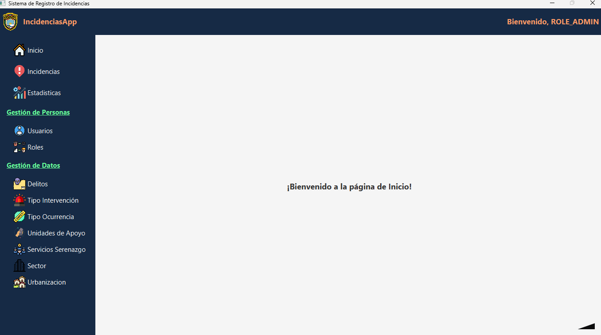
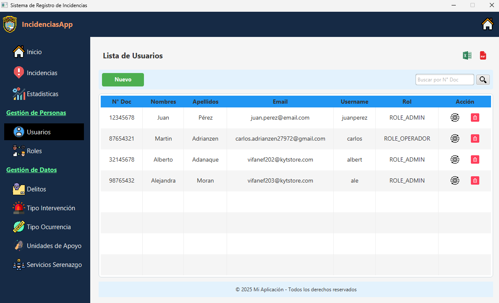
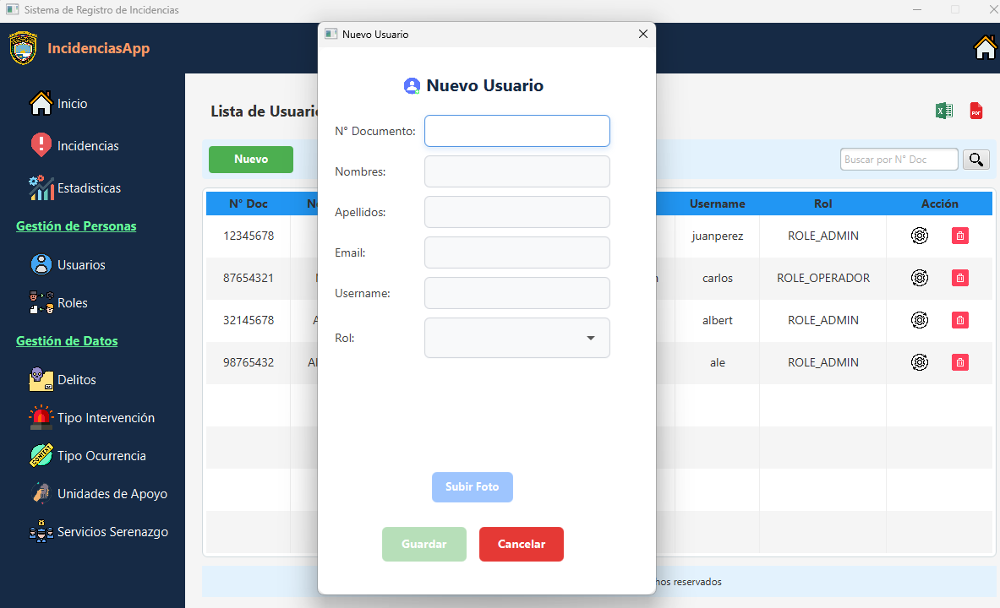
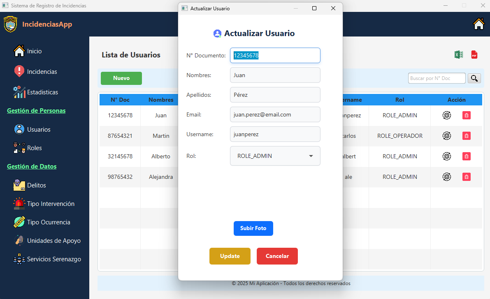

# 🚔 IncidenciasApp - Sistema de Registro de Incidencias

**IncidenciasApp** es una aplicación de escritorio desarrollada en **Java, Jakarta EE y JavaFX**, con una base de datos en **MySQL**. Permite registrar y gestionar incidencias en una comisaría o centro de vigilancia, ofreciendo funcionalidades como autenticación de usuarios, asignación de roles y generación de reportes con **JasperReports**.

## 🛠️ Tecnologías Utilizadas
- **Lenguaje:** Java (Jakarta EE)
- **Interfaz:** JavaFX (FXML)
- **Base de Datos:** MySQL
- **Persistencia:** JPA
- **Generación de Reportes:** JasperReports
- **Control de Versiones:** Git y GitHub

## 📷 Capturas de Pantalla [Avanzado hasta 26/02/2025]

### 🗂️ Diagrama Entidad-Relación (DER)


### 📊 Dashboard / Panel Principal


### 👥 Gestión de Usuarios y Roles




## 🎯 Funcionalidades Principales [Implementandose]
✅ Inicio de sesión seguro con autenticación y roles  
✅ Registro, consulta y gestión de incidencias  
✅ Administración de usuarios y asignación de roles  
✅ Generación de reportes en PDF con JasperReports  
✅ Persistencia de datos en MySQL con JPA  
✅ Interfaz gráfica intuitiva con JavaFX  

## 🚀 Instalación y Configuración

### 📌 Prerrequisitos
Antes de ejecutar la aplicación, asegúrate de tener instalado:
- **JDK 17 o superior**
- **MySQL Server**
- **JavaFX (si es necesario configurar en tu entorno)**
- **Maven (para gestionar dependencias)**

### 📥 Clonar el Repositorio
```sh
git clone https://github.com/cd28dev/incidencias_app.git
cd incidencias_app
